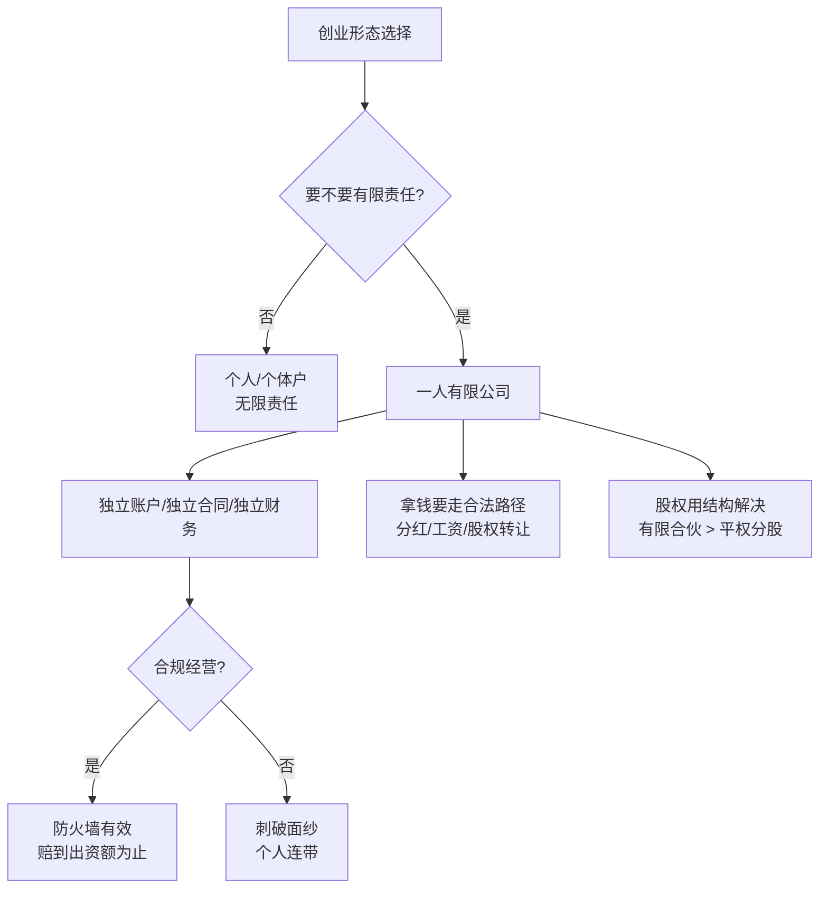

## 一、结构化梳理（程序员友好版）

### 1. 什么是 OPC？先分清三种「一人创业」

日常说的 OPC，在法律人眼里其实是三种东西：

| 类型 | 形态 | 核心风险 |
|------|------|----------|
| **① 个人名义经营** | 以个人身份签合同、收款 | 无限责任，资产全暴露——律师眼里像「裸奔」 |
| **② 个人独资 / 个体户** | 有主体，但和自然人强绑定 | 连带责任，像「薄防晒衣」 |
| **③ 一人有限公司** | 1 个股东、全额出资的有限责任公司 | **有限责任** + **独立法人**——「防火仓」 |

程序员类比：
- ① = 没有 namespace，所有变量全局可见
- ② = 有 namespace，但和主进程共享内存
- ③ = 独立进程 + 有限 liability boundary

---

### 2. 中国 OPC 政策时间线

```
1993  公司法诞生 → 禁止一人公司
2004  放开一人公司，但限制很多（只能设 1 家等）
2023  公司法大修 → OPC 被「认可甚至鼓励」
2025  OPC 注册量同比 +300%（与 AI 创业潮强相关）
```

全球更早：
- **列支敦士登**：约比中国早 100 年有成文 OPC 法
- **Salomon 案（1897）**：全球第一个承认「一人公司独立法人」的判例（萨洛蒙皮靴品牌）

---

### 3. 一人公司的核心价值：有限责任 + 人格独立

**成立前提**：你和公司是两个人。

- 公司赚的钱 ≠ 天然是你的 → 要通过分红、工资、股权转让等合法路径拿钱
- 公司的债 ≠ 天然是你的 → 原则上以出资额为限

**破产边界举例**（认缴 10 万）：

| 场景 | 最多赔多少 |
|------|------------|
| 实缴 10 万，亏光 | 10 万，公司人格消灭，你全身而退 |
| 实缴 5 万，账上剩 5 万 | 还要补 5 万（认缴没交清） |
| 2023 年前认缴 3000 万、实缴 300 万、债 1000 万 | 破产时要补足认缴额——历史惨案很多 |

**2023 新公司法**：认缴须在 **5 年内实缴**，否则工商部门会追。

---

### 4. 「防火仓」不是无敌的：刺破法人面纱

一人公司的防火墙 = **装了很多摄像头的防火仓**。

以下行为会让防火墙**直接消失**（公司变你的「影子」）：

1. 公司账付私人消费（马尔代夫团建、红包等）
2. 公司借钱给亲戚换汇，钱回流个人
3. 大单走公司、小单走微信（混同收支）
4. 用 A 公司给 B 公司供应商付款（关联公司资金混用）
5. 母子公司之间不规范垫款

**关键差异**（对程序员很重要）：

- 普通有限责任公司：债权人想「刺破面纱」→ **债权人举证**
- **一人公司**：出现上述情况 → **你要举证证明公司和你是分开的** → 举证责任倒置，证不了就连带责任

政策总结四个字：**宽进严管**。

2023 年后还要求：一人公司财务报表须 **第三方审计**。

---

### 5. 签合同：形式 vs 实质

- 没签合同、只有口头 + 半年按月付款 → 法律上仍可能构成**事实合同**
- AI 能生成漂亮合同，但**不会反问你**——这是律师和 AI 的核心差异

**合同真正价值**不在漂亮条款，而在**可执行的细节**：

- 「交付」到底怎么算？改两次后视为交付？对方 3 天不回视为验收？
- 付款时间、方式、滞纳金
- 违约金写「全部实际损失」→ **烂条款**（损失难举证、诉讼拖很久）
- 正确写法：约定 **合同标的 20%–30% 违约金**，举证责任在违约方

---

### 6. 股权结构：从踩坑到解法

#### 案例 A：40% / 30% / 30% 平分式入股

Perry 拿 40%，投资人 Ares 30%，搭档 Bruce 30%。

问题：两人合计 60%，重大事项需 >50% 同意 → **创始人说了不算**。

#### 解法：有限合伙（LP）平台架构

- 创始人做 GP（普通合伙人），占 1% 甚至 0.5%
- 投资人 / 员工做 LP（有限合伙人），出钱不参与经营
- GP 天然拥有**全部表决权**——法律赋予，不靠协议硬凑
- 可嵌套多个 LP 主体，方便发「干股」绑核心员工（≤50 人）

#### 案例 B：股权代持

- 工商登记 75% 代持 + 代持协议看似完美
- **上市主体迁移**时链条断裂 → 被诉
- **配偶未签放弃书** → 离婚时股权可能被分割，前夫成第四大股东 + 一票否决 → 公司被拖死
- 刘强东案例：京东上市前让奶茶签放弃书——同一逻辑

---

## 二、案例速查表（帮你记公司法）

| 案例 | 教训 |
|------|------|
| **Salomon v Salomon（1897）** | 一人控制的公司也可独立担责，奠定现代公司法基石 |
| **个人名义接飞书 300 万活动单** | 活动质量纠纷 → 对方索赔续签损失，个人模式下全部资产可被执行 |
| **公司账付马尔代夫旅游** | 典型刺破面纱，防火墙消失 |
| **大单公司收、小单微信收** | 财务混同，一人公司最危险 |
| **Elsa 被赠股权合作案** | 对方要的是你的品牌+产品+影响力，却用「免费股权」绑定你；应改为授权费 + 服务费 + 合作协议 |
| **飞书延迟付款「赔偿全部损失」条款** | 看似保护己方，实则难举证、难执行；应写固定比例违约金 |
| **40-30-30 股权** | 两个 30% 可联合否决，创始人失控 |
| **有限合伙 GP 1%** | 用法律结构保控制权，比堆协议稳 |
| **代持 + 主体迁移** | 代持链条必须全程可追溯，否则你成被告 |
| **代持未让配偶签放弃书** | 婚变 = 新股东进门 + 恶意否决 |

---

## 三、给程序员的公司法「心智模型」



**三条铁律**：
1. **人格独立是实质，不是注册个壳就行**
2. **一人公司：证不了清白就有罪**（举证责任倒置）
3. **AI 给答案，律师该问问题**——犹豫时别只问 AI

---

## 四、朋友圈 / 社交媒体金句

精选可直接发，按场景分类：

### 认知类
> OPC 不是新话题，Salomon 案 200 年前就打过了——一人公司独立担责，是全球公司法的起点。

> 2025 年全国 OPC 注册量同比 +300%。AI 让一个人就能创业，也让「防火仓」变得更重要。

> 大公司拆成乐高模块，个人经济体崛起——OPC 不是退路，是结构性的方向。

### 风险警示类
> 以个人名义做生意，在律师眼里就是「在楼顶裸奔」——身上所有东西，债权人都能追。

> 一人公司的防火墙不是无条件使用的：装了很多摄像头，违规一次，防火墙直接消失。

> 政策四个字：**宽进严管**。欢迎你来设公司，但我会查你和公司到底是不是两个人。

> 大单走公司、小单走微信——这不是省税，是给债权人送刺破面纱的证据。

### 合同 / 商业类
> 合同最大的价值不是好看，是帮你想清楚：什么叫交付？三天不回算不算验收？

> AI 不会反驳你，只会说「好的我懂了」——犹豫的时候，你需要的是提问，不是答案。

> 违约金写「赔偿全部损失」是烂条款；写「合同金额 30%」才是能打赢的条款。

> 对方不要你的钱，非要给你股权——先问自己：他到底想拿走什么？

### 股权结构类
> 公司是你的，但 40-30-30 的股权结构下，你可能说了不算。

> 有限合伙里 GP 占 1%，表决权 100%——这是法律送的，不是靠协议硬写的。

> 股权代持，别忘了让配偶签放弃书。不然离婚那天，前夫可能成为你的第四大股东。

### 金句合集（短平快，适合配图）

1. **「防火仓很有用，但上面全是摄像头。」**
2. **「注册公司不等于安全，形式完美、实质混同，一样裸奔。」**
3. **「公司赚钱不等于你赚钱，你是股东，不是公司口袋。」**
4. **「证不了清白，在一人公司就是有罪推定。」**
5. **「律师写合同越写越短，因为有用的都是那些不专业的细节。」**
6. **「AI 能穷尽可能性，但不会问你：你到底想要什么？」**
7. **「宽进严管——门开着，但每个防火仓都有人看。」**

---

如果你愿意，我可以再帮你做一版：
- **「程序员开 OPC 检查清单」**（注册前 / 经营中 / 签合同 / 股权变动）
- 或把某几个案例展开成**故事体短文**，更适合发长文朋友圈。